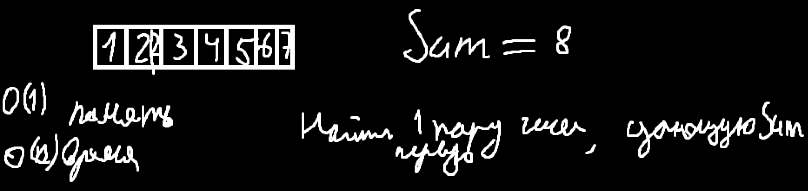

## Семинар 1
### Орг инфа
Дибильники перед каждой сдачей задания, хорошо показываете - меньше задач, меньше показываете - меньше задач. Всего 4 задания. 


### Массивы и списки

O(1) доступ, добавление O(1) в лучшем, в худшем O(n)


Бывают односвязные и двусвязные списки, доступ O(n) в среднем 

array - стат. массив, vector - дин. массив

std::list - двусвязный список, std::forward - односвязный список


### Задачки
#### 1.


Идея:


Решение:
```cpp
struct Node {
    Node* next = nullptr;
    int val = 0;
};

Node* ReverseList(Node* head) {
    if (head == nullptr) {return nullptr;}
    Node* cur_pos = head;
    Node* next_pos = cur_pos->next;
    Node* prev_pos = nullptr;
    while (cur_pos) {
        cur_pos->next = prev_pos;
        prev_pos = cur_pos;
        cur_pos = next_pos;
        if (cur_pos) {next_pos = cur_pos->next;}
    }
    return prev_pos;
}; //Наша память не может увеличиваться с увеличение входных данных - O(1) (нужно чтобы было O(n))
```


#### 2.


Идея: cделать 2 указателя slow и fast, если список закольцованный то s и f рано или поздно сойдутся, иначе - (fast==nullptr - не закольцованный)

Решение: 
```cpp
struct Node {
    Node* next = nullptr;
    int val = 0;
};

bool IsCircled(Node* head) {
    Node* fast_ptr = head;
    Node* slow_ptr = head;
    while(fast_ptr != nullptr && fast_ptr->next!=nullptr) {
        slow_ptr=slow_ptr->next;
        fast_ptr=fast_ptr->next->next;
        if (slow_ptr==fast_ptr) {
            return true;
        }
    }
    return false;
}
```

### 3.



