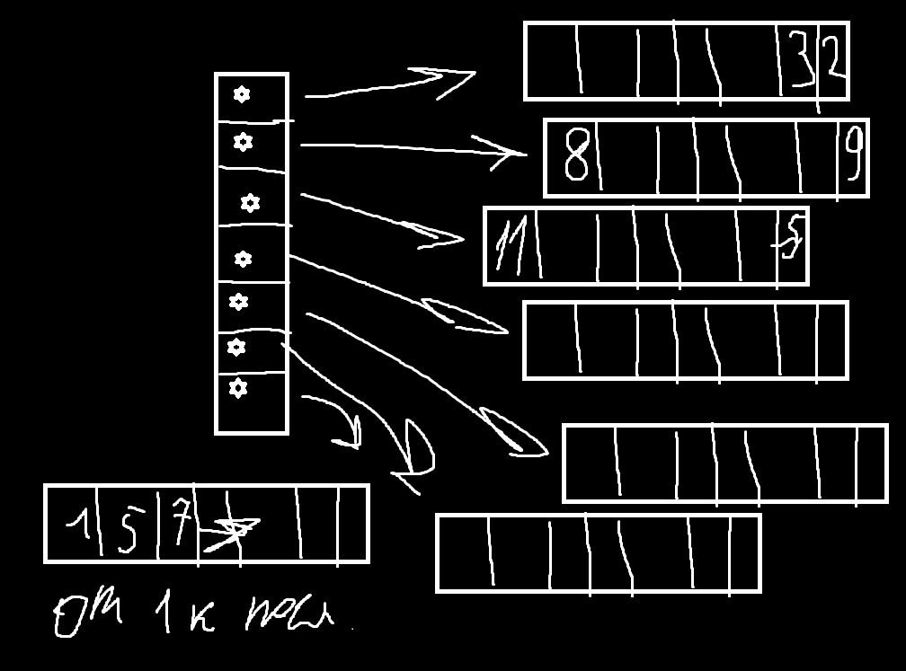
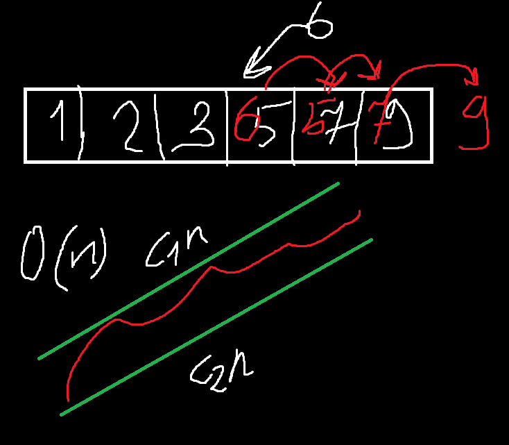
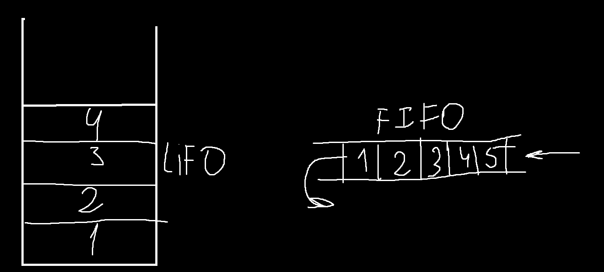
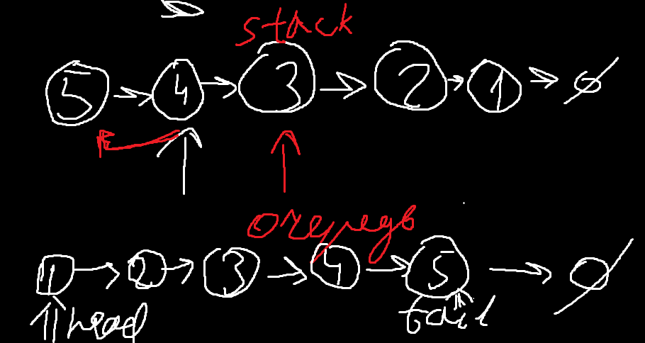
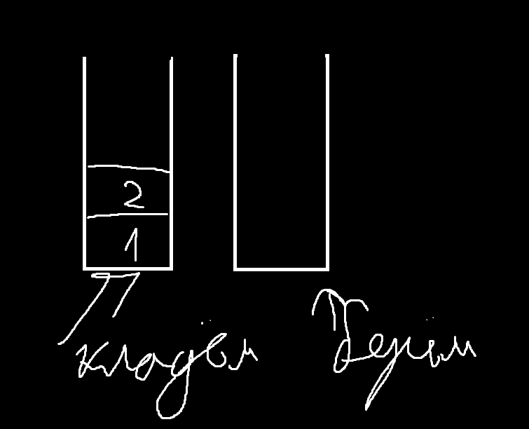

## Семинар 2

### в Прошлый раз
говорили про массивы, односвязный - std::forward_list, двусвязный - std::list

### std::deque"<>" (без кавычек)

Создана на освное вектор - типо очередь. Это вектор указателей. Они указывают на Чанк - типо фиксированной длины массив.



Время вставки - O(n)



Валидация итераторов

### Очередь и Стэк

Стэк - стакан куда кладем элементы, извлекаем в обратном порядке, не можем извлечь 3 пока не извлечем 4 и тд





### Задачи

#### Задача 0

Простой пример


Сложно: есть куча очередей, надо сделать стэк добавление O(1), вставка O(n)
Занимаемся перекладываниями постоянными, пока нужный не наберется

#### Задача 1 (Собеседование форбс)

В Стек есть 2 операции - push и pop и пустота
Найти максимум в стеке за O(1)

```cpp
class Stack {
    std::stack<int> val_stack;
    std::stack<int> max_stack;
    public:
    void push(int n) {
        val_stack.push(n);
        if (max_stack.size()==0) {
            max_stack.push(n);
        } else { 
            int m = max(max_stack.top(), n);
            max_stack.push(m);
        }
    }
    int max_elem() {
        if (max_stack.size()==0) {
            throw std::runtime_error("stack is empty");
        }
        return max_stack.top();
    }
    //pop - удаляем из обоих
};
```

#### Задача 2 (Собеседование Яндекс + предыстория)
надо ограничить кол-во вызовов, и при каждом вызове будет вызываться функция
пытаемся написать rps - rhs per seconds для легкого распределения между процами 

сравниваем временную метку, больше секунды - выкидываем, при этом считаем количество вызовов
```cpp
//Запрос - функция
bool IsPossible()
```

