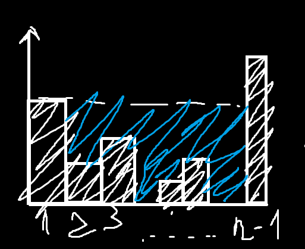
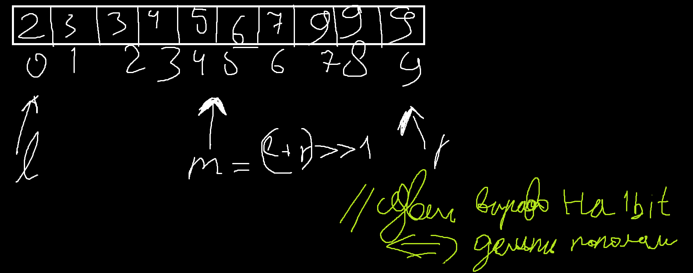
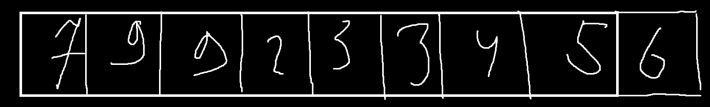

## Семинар 3 

### Задача суперсложная 



Используем стэк:

```cpp

int rain_water(std::vector<int> height) {
    std::stack<int> st;
    int ans=0;
    for (int i=0; i<height.size();++i) {
        if (st.size()==0) {
            st.push(i);
        } else if (height[st.top()] > height[i]) {
            st.push(i);
        } else {
            int prev=0;
            while (st.size()>0 && height[st.top()]<=height[i]) {
                int cur = height[st.top()];
                ans += (cur-prev)*(i-st.top()-1);
                prev = cur;
                st.pop();
            }
            st.push(i);
        }
    }
    return ans;
}
```

### Бинарный поиск

Есть массив 



O(logN) 

Есть рекурентное соотношение T(n)= T(n/2) + O(1) - их можно решать , но Аношин не будет нас учить этому

Пусть на перавой итерации был массив длинной n, на второй n/2, на третьей n/4 и тд.... пока на k итерации массив не будет 1 когда нашли наше число. Если знаем n, то как выразить k через это? n=2^k => k=logN 

### ДЗ 

Есть массивчик

  

Найти заданный элемент за O(logn) 

Просьба к оформлению - делаем отдельный репозиторий и в другую ветку кидаем