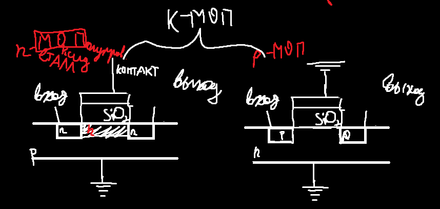

## Семинар 1

### Орг. Вопросы

Кадочников Илья Николаевич; Ближе к 4 занятию ноуты; Победа, читать сильно не нужно, тестов не будет; 2 задания, дифф. зачет

### Архитектура Компьютеров

#### Компьютер - прибор, работающий на физических дисциплинах (ниже схема читается снизу вверх)
_____________
Прикладные программы, asm (создаются на различных языках, невероятно низкоуровневый язык - язык Assemblerа. Assembler - программа, превратит язык assemblera в исполняемые файл, например для сложения двух числе - add, call - вызов функции, jump - перепрыгнуть с одной инструкции на другую, asm язык assemblera очень близкий для команд процессора, но не одно и то же, компиляция в неск. этапов, )
_____________
Операционная система (организует запуск программ, процесс виртуализации - каждая программа думает что она одна и никто не конфликтует друг с другом, всякие вспомогательные функции и тд, считаем библиотекой инструментов)
_____________
Архитектура команд процессора (проц должен уметь выполнять программы, а программы должны переведены на язык команд. Каждый проц поддерживает язык простых команд; **x86-64**, ARM(телефоны) - описание архитектур команд процессора, прерывания;важен для прикладных программистов, команд опускается)
_____________
***Микро***архитектура процессора (как конкретно на уровне цифровых схем устроен проц)
_____________
Цифровые схемы (логический вентиль, регистр(ячейки памяти), сумматор(операции)) превалирует дискретная математика
_____________
_____________
Аналоговые схемы (резисторы, конденсаторы, транзисторы и тд)
_____________
Физика - База
_____________
Прочерки - абстракция; абстракция протекает - если работаем на опред. уровне абстракции, то не можем на 100% абстрагироваться от соседних уровней; Буфер - задержка передачи сигнала. Важно понимать как код переходит в машинный код для контроля программы, эффективности и тд. 
Цифровые схемы от аналоговых отличаются 2 уровнями сигнала (0, 1); 
В реальном физическом меняется все непрерывно(в аналоговых)

#### Задача для курса - * рассмотри физику и аналоговые схемы, ** несколько (3-4) занятий про цифровые схемы и микроархитектуру, *** рассматрим архитектуру x86 для того чтобы уметь читать программу на языке asm, самая глобальная цель - получить представление о том как структуры на языке c++ переводится в asm, чтобы лучше понимать как сделать эффективную программу

#### Немного про цифровые схемы, аналоговые схемы и чуть про физику
Логический вентиль И, ИЛИ, НЕ, И-НЕ, ИЛИ-НЕ

Пусть у схемы n входов, и выдает 1 если на входах 1 больше, чем 0, иначе 0

По таблице истинности можно сразу понять и перейти к цифровой схемe; записав таблицу истинности мы можем записать соотв. цифровую схему

Нанометры - нм - относятся к размерам ключевой составной части транзистора; Транзистор в процессоре выполняет роль переключателя, напоминает реле, регулируем проход через него ток или нет. У него есть каналы и есть доп вход, в который можно подавать напряжение, управляем сопротивлением

Процессор - Кристалл т.к. в транзисторах используются полупроводники (Кремний - Si), поэтому кристаллики кремния

Кристалл кремния легируется. Полупроводник носитель электрона - n-тип (negative)

Плохая логическая единица (напряжение), логический 0 (земля) хорошая

К-МОП - комбинированный

