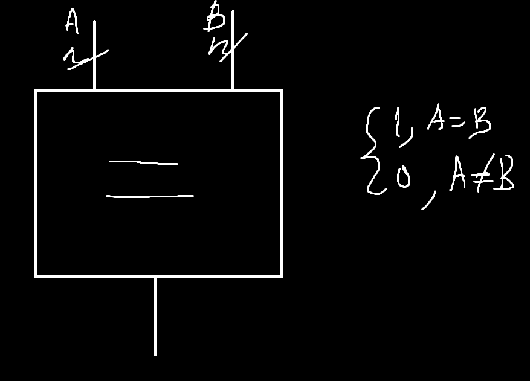
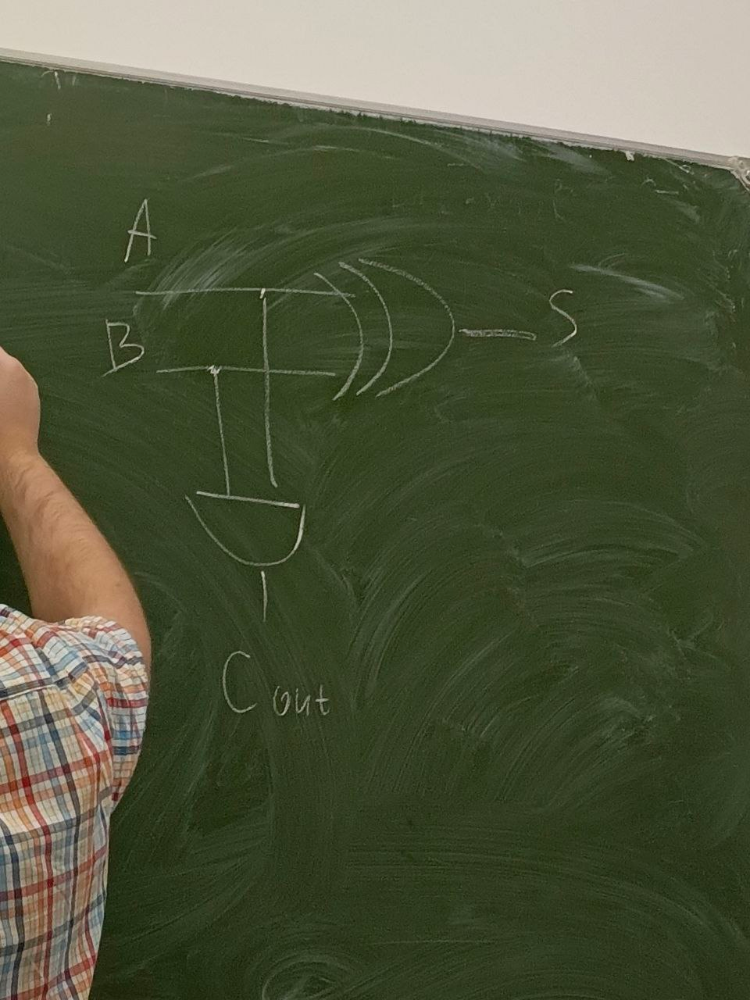
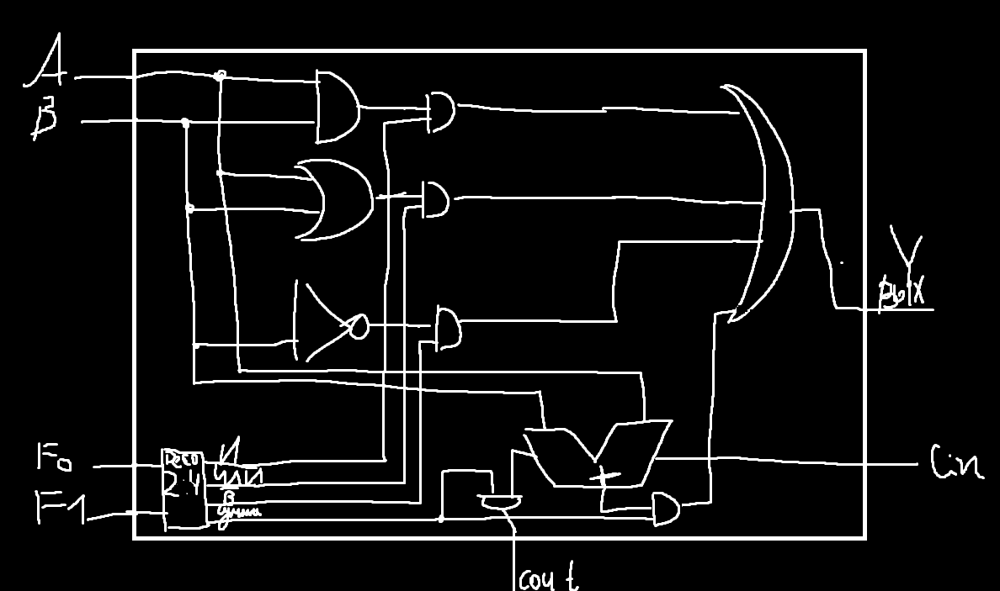

## Семинар 2

На прошлом семинаре мы разобрали физический уровень, аналоговый уровень (транзисторы), цифровые схемы (логические вентели).

Сегодня так же остаетмся на цифровых схемах, но возьмем чуть выше - цифровые интегральные схемы. На самом деле если уж говорить про след. уровень - микроархитектура процессора, то проц не проектирует логические вентели. Логические вентели собирают в интегральные схемы. Есть нек-рый набор базовых схем, являющихся строительными блоками на уровне микроархитектуры процессора. Сегодня познакомимся с интегральными схемами и разберемся как можно собрать из этого процессор. 

### Комбинационные схемы и последовательные схемы

Комбинационные схемы - значение зависит от входа

Последовательные - значение зависит и от предыдущих => нужно существование памяти

#### Комбинационные схемы
Критерии:
1. Каждый элемент схемы является комбинационной схемы. (хотим лог. ентели объединять в структуры)
2. Соед. элемент в комб. схеме должен быть или входом, или должен подсоединяться к выходам одного из элементов (не может приходить сигнал одновременно из 2 выходов)
3. Отсутствие циклов

 

Ширина шины - n, n`

#### Цифровые модули - некоторые схемы

Мультиплексор - первый вариант схемы. Придерживаемся схемы за авторством Хэррис

Для простоты рассмотрим мультиплексор с двумя управлющими сигналами (s1, s2) и четырьям входами (D0, D1, D2, D4)

  

Хотим симулировать через мультиплексор логический вентель "И"

Следующая схема - декодер(дешифратор). Его идея - Напоминает мультиплексор об n каналах управляющих, но не 2^n входов, а 2^n выходов, управляем через n входов

Демултиплексор - добавляем Y

Коммутатор (мультиплексор является частным случаем коммутатора) => идея - 1 вход соединяем с 1 выходом по разным управляющим шинам

### Арифметические схемы (тоже комбинационные, выход зависит от входа)

#### Компаратор

Она должна сравнить 2 числа и вернуть единичку (1) или нолик (0). (Пусть число - значение на выходе шины)

 

Также на прошлом занятии забыли про XOR (искл. Или) (отвечает на вопрос "отличаются ли 2 числа?")

 

Соответственно НЕ XOR - наоборот, отвечает на вопрос "равны ли 2 числа?"
Есть и компараторы которые сравнивают больше меньше - уменьшают одно из чисел 

#### Сумматоры

Четверть сумматора (XOR): (потому что нужно еще чтобы собрать)

 

Полусумматор:

 

Сумматор:

  

Количество битов - ширина шины памяти

Сумматор и компаратор - 2 арифметических блока, база

Можем разбить цепочку на 2 половинки, независимо вычисляем младшие разряды и старшие разряды (дважды - когда придет битик переноса и когда не придет)

### АЛУ - Арифметика логических устройств

Считаем что на вход приходят 2 бита - А и Б и 2 F (не полный сумматор, если убрать не B, тк нужно Cin доп вход для полного сумматора)

Полный сумматор:

### Схемы

RS-защелка
Сигнал распространяется с конечной скоростью. S=Set, R=Reset

 

Генератор импульса - кварцевый генератор

Синхронная RS-Защелка

Синхронная D-Защёлка

 

Если его соединить с Синхронной D-защелкой (подключить вместо тактового напряжения) - получится D-тригер (Clk - Clock). Бывают разные варианты (с set, reset и тд)

#### Регистр

 3-битный регистр