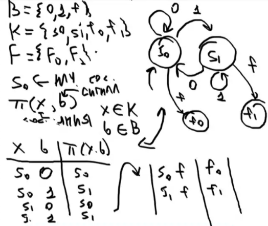

## Семинар 3

### На прошлом занятии

### Простейший исполнитель алгоритмов

#### Автомат конечного состояния

Конечный - есть n разрядов, то 2^n состояний, конечное количество состояний, поэтому конечный

Почему конечные автоматы похожи на современные процессоры? С натяжкой, но сходства: в процессоре есть внутренняя память как набор регистров

Конечный автомат - некоторая конечная система, из одного сигнала может переходить в другое. Простейшие преобразователи последовательности входных сигналов в последовательности состояний, позволяет решать довольно большое количество практических задач. Одновременно развивалась и теория алгоритмов, посмотрим на задачки

K - конечный набор состояний

Наша система в самом начале работы должна быть в каком-то состоянии - S0 принадл. K. F входит в мн-во K - состояние останова 

B - конечный входной алфавит 

Pi: K*B -> K - функция переходов

#### Задача, решаемая с помощью конечного автомата
У нас есть конечный автомат, на его вход поступают числа из набора B={1,0}; 
Мы хотим решить задачу: хотим чтобы автомат говорил четное число или нечетное.
K={S0 - четное число, S1 - число нечетное}; число приходит в двоичной записи 
F=пуст. мн-во; s0 - начальное состояние;
Pi(x,b), где x - состояния, а b - состояния сигналов x принадл K, b принадл B

 

f0 и f1 - тк наш автомат должен отвечать на вопрос, он окажется в одном из терминальных состояний, именно этот факт будет отвечать на вопрос, четн или нечет, для этого завели f0 И f1

Примерная кодовая интерпретация

#### Автомат Мили 

 

конечный автомат с действием. Последовательность переходов. Диаграмма, Таблица переходов:
Автомат мили и Автомат мура отличаются тем, что у нас добавляется условие перехода в предыдущее состояние

#### Прибавление единички к числу 

### Машина Тьюринга

Проговорим некоторый момент - связанный с ограничениями конечного автомата - у него нет памяти. Машина Тьюринга - расширение исполнителя конечного автомата, добавлением ему памяти - бесконечной ленты с ячейкой. Можно писать на нее, читать с нее, расширяя класс задач до всех вычислимых задач впринципе. Тьюринг-полный - имеют в виду полный с точки зрения "можем решить любую вычислимую задачу" "вычислимая - можно придумать алгоритм для решения" 

