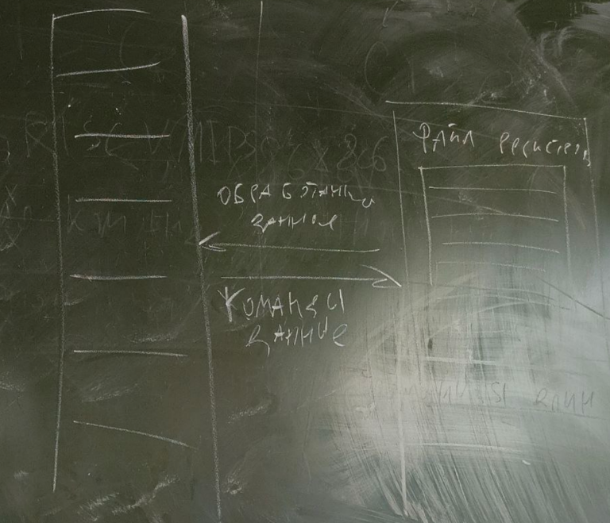

## Семинар 5

#### Архитектура - то что для программиста - набор команд, инструкций регистры процессора, флаги, состояние процессора видимое программистом

Некоторая модель , на низкоуровневом языке которого пишет программист. Реализацию на уровне цифровых схем мы называем микроархитектурой. 

Процессор - цифровая схема, которая интерпретирует поток двоичных данных как поток команд, он выполняет их и обрабатывает как-то. Если стоит несколько задач у процессора - нам достаточно написать новый алгоритм

Процессоры принято делить на 2 маткласса - ReduceISC процессора (сокращенный набор инструкйи, риск архиткетуры) и ComplexISC

Самая известная CISC-архитектура -X86, также RISC - ARM, RISC-V, **MIPS**

Сравним качественно. Reduce - относительно мало команд, когда в CISC - много команд

Кроме того в Архитектуре RISC команды простые, в CISC - сложные

У CISC - переменная длина команды, а у RISK - Фиксированная длина команды 

#### Архитектура MIPS

Скажем что процессор - некоторый ящичек с цифровой схемой. Про память - это что-то вненее для процессора. У процессоров есть ячейки памяти, но основная память внешняя. Смотря на процессор как программист - мы видим там регистр. Говоря о битности процессора мы говорим какую ширину шины памяти мы можем прочитать. Совпадает размер указателя с шириной регистра. Битность процессора - количество бит в регистре. Они служат кармашками чтобы туда помещать данные где мы можем их обрабатывать. Программист может сказать загрузи мне команду пожалуйста данные из такой-то ячейки памяти. То есть регистры и как к ним обращаться это часть архитектуры. Регистры общего значения - могут фигурировать в общих командах (сложение вычитание загрузка в память и тд)



Существуют другие регистры специального значения для специальных команд

```
add $t0, $s1, $s2
```
add - cсложение. Нужно в регистр t0 поместить сумму значений $s2 и $s1.

$t0=$s1+$s2

4 байта - слово

addi - immediate, нужна обязательно константа 

j - jump - команда позволяет перейти на адрес который 

Assemnly code - как команда выглядит для программиста.