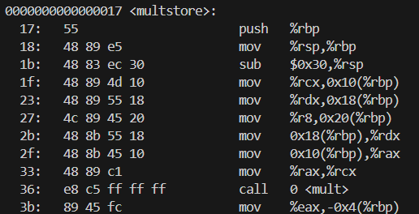

## Cеминар 6


#### Микроархитектура - реализация архитектуры
Сегодня занимаемся x86-64, на прошлом MIPS.
CISC со сложным набором команд

-og - флаг оптимизации

# Про gcc
1) Препроцессинг - define, include и т.д.
2) Компиляция - получаем .obj Win | .o Linux
3) Линковка

Нет точки входа main() - не сможем начать производить линковку

Чтобы остановитсья между шагами 2 и 3  я пишу:
```shell
gcc multstore.c -c
```
получили multstore.o - объектный файл - машинный код, но еще не можем начать исполнять
Поэтому
1) Препроцессинг - define, include и т.д.
2) Компиляция - получаем файл с кодом на язык Assembler'а => .s | .a               -S
3) Ассемблирование (сборка от assemble - собирать) => .o                           -c
4) Линковка => .exe

```shell
gcc -S multstore.c
```
Для оптимизации -Og и добавляет доп инструкции в ассемблерный код
```shell
gcc multstore.c -S -Og -fno-asynchronous-unwind-tables
```

.sh $@ 

.bat %*

в линуксе после to_asm.sh:
```shell
chmod +x to_asm.sh
```
-g - сохраняем отладочную информацию 
onjdump - исследуем файл .o
```shell
objdump -g multstore.o
```
секция с кодом начинается с директивы .text 

Слева - машинный код, справа - ассемблерный код

