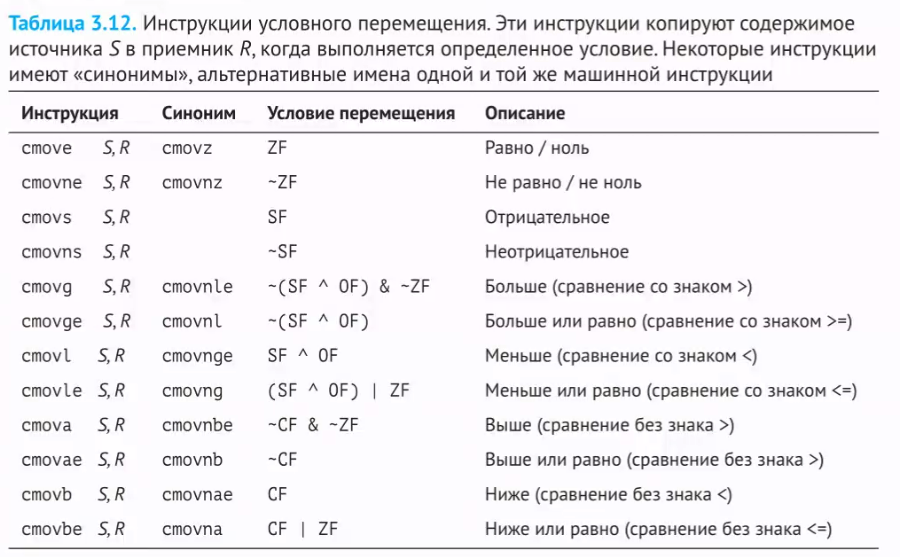
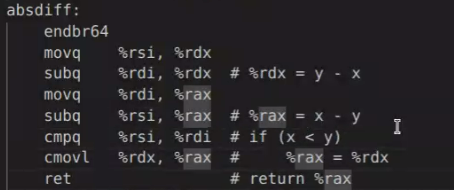
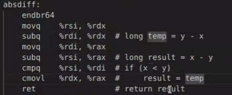
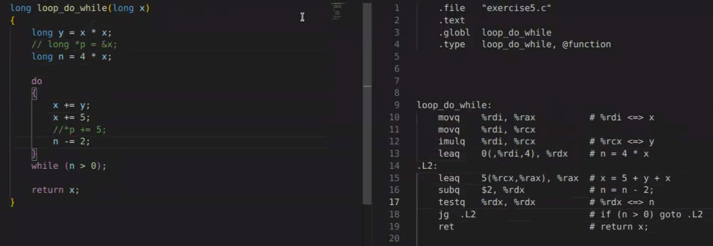
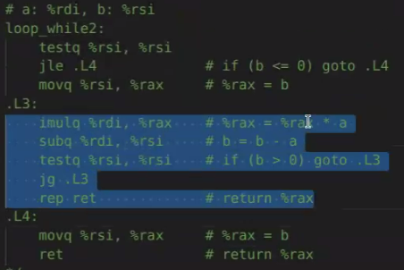

## Семинар 10

#### Повторение
CF, OF, ZF, SF, cmp(sub) test(and)

js - одна из вариаций инструкций перехода, jump signed - отрицательное. Если число имеет знак(старший бит) у нас произойдет переход

#### что-то новенькое 

je - переход равно нулю

test %rsi, %rsi <=> cmp &0, %rsi - сравнение с нулем

a>*p <=> !(*p>=a)

```c
long v=0;
if (test_expr) 
    v = then_expr;
else 
    v = else_expr;
```
<=>
```c
long v = test_expr ? then_expr : else_expr;
```
<=>
```c
v = then_expr;
ve = else_expr;
t = test_expr;
if (!t) v = ve;
```

cmov - перемещение по условию 








cmov занимает 1 такт, он быстрый, но больше байт занимает 

```c
long f(long *xp) {
    return (xp ? *xp : 0);
}
```

### Циклы

самый простой - do while

```c
do
    body_statement
while (test_expr);
```
в asm:
```shell
loop:
    body-statement;
    t = test_expr;
    if (t) goto loop;
```

while:
```c
while (test_expr)
    body-statement;
```
asm:
```shell
    goto test;
loop:
    body-statement;
test:
    t = test_expr;
    if(t) goto loop;
```
do с предусловием - с точки зрения компилятора более выгодное
```shell
    t=test_statement;
    if (!t) goto done;
loop:
    body-statement;
    t=test_statement;
    if(t) goto loop;
done; 
```



