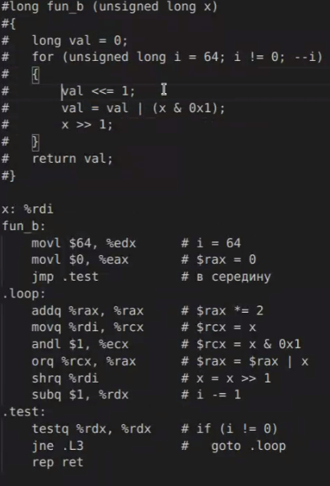
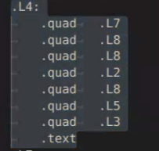
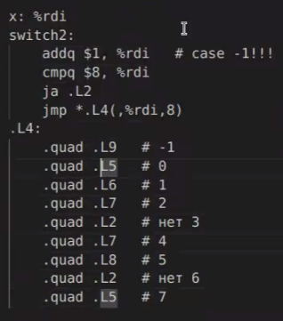

## Семинар 11

### Цикл for

```shell
for (init-expr; test-expr; update-expr) { 
    body-statement;
}
#псыж в сер.
    init-expr;
    goto test;
loop: 
    body-statement;
    прыж-expr;
test: 
    t=test_expr;
    if (t)
        goto loop;

#do с предусловием
```



```c
long sum = 0;
for (long i = 0; i<10; ++i) {
    if (i&1) { //проверяет четность нечетность
        continue;  //компилятор скорее всего goto update сделает
    }
    sum +=i; //суммируем четные числа
}
```

### swith case

вспомним про его особенности

```c
switch(выражение) {
    case значение0: //инструкция 1, в фигурных скобках можем объявлять переменные
        ...
        break;
    case значение1: //инструкция 2
        ...
    ...
    case значениеN: //инструкция 3
        ...
    default:
        //инструкция по умолчанию
}
```

```c
int JumpTable(unsigned long i)
{
    //таблица переходов
    static const void* jump_table[] = 
    {
        &&lable0, &&lable1, &&lable2, 
        &&lable3, &&lable4, &&lable5, 
        &&lable6, &&lable7, &&lable8, 
    };

    if (i>8) {return -1;}
    
    goto *jump_table[i];
lable0:
    return 0;
lable1:
    return 1111000;
lable2:
    return 2;
lable3:
    return 1111;
lable4:
    return 2;
lable5:
    return 1111;
lable6:
    return 2;
lable7:
    return 1111;
lable8:
    return 2;
}
```

Под капотом у свитч кейс работает таблица переходов, которая эффективна для больших знчений

Объявление в ассемблере массива 



(quad говорит "пожалуйста выдели 8 байт памяти" чтобы там распологались адреса, ведь каждая метка получает адреса quad - 4 слова (слово - 2 байта). Фактически - массив адресов. Точно так же хотим получить с помощью static const... Когда программа будет скомпилированан там будут стоять числа.)

```c
long SwitchTest(unsigned long i) {
    switch(i)
    {
    case 0:
        return -111;
    case 1:
        return -222;
    case 2:
        return -222;
    case 4:
        return -222;
    case 5:
        return -3333;
    case 6:
        return -003333;
    default:
        return -1;
        break;
    }
}
```

Появилась таблица переходов в ассемблерной инстуркции. Есть точно такая же проверка на дефолтную веточку. Мы точно такую же проверку писали чтобы не возникло Undefined behavior

Jump точно такая же



-fno-pie

leaq - load effective address

%rip - вычислим
