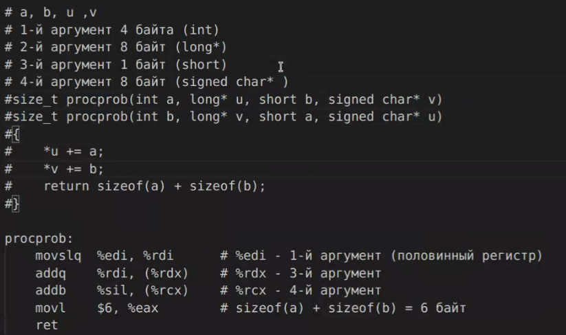

## Семинар 12

# Как вызывать функции?
- Через регистры можно передававть только 6 значений
- Больше - можно передавать через стек, но это сильно медленнее, чем через регистры.


8 Байтов - %rsi; 4 байта - $esi; 2 байта - %si; 1 байт - %sil

3 аргумент - 1 байт


Если видим неполный регистр, то мы могли передать что-то через полный регистр и взять младший байтик и записать в память
Можно ли наоборот? Поступили так с первым аргументом, передали 4 байта записали 8 (расширили). Если не расширять - undefined behavior не знаем что лежит в старших битах



### Стэк

%rsp со стэком работает, можно расшифровать. Пуш и Поп есть pushq и  popq. После них будут стоять некоторые регистры. pushq поместим регистр на стэк, popq восстановит значение регистра, также к %rsp можно обращаться просто к регистру, который хранит число, в коде можно заменить что там числовые оперцаии, если что явно изменяем значение на указатель вершины стека. Стек растет вниз, хоти увеличить стэк - нужно вычесть число. Если хотим уменьшить - прибавляем число к регистру %rsp. Есть доп усложнения, которые приводят к тому что часто видим работу со стеком и нужно быть внимательным, тк регистр %rsp Callee Saved - используем для сохранения значенния которое мы не можем менять, иначе нарушение о соглашении с функциями 


```c
long Q(long* a, long* b);

long P(long* a, long* b) {
    return Q(a, b) + Q(a, b);
}
```

Часто мы будем видеть что какие-то регистры мы прячем на стэк а другие восстанавливаем в обратном порядке. Это callee saved 

перед вызовом функции прячем регистры в коли сэйвд, после вызова - восстанавливаем, а потом еще раз вызываем функцию q

### Проблема с возвратом функции
```shell
movq $10, %rsi
call Q
addq $1, %eax
```

Адрес возврата является частью вызываемой функции

### Передача более 6 аргументов в функцию? Через стэк
предварительно перед вызовом функции помещаем их на стэк


генерит ворнинги компилятор - эта волшебная строчка


