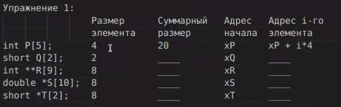
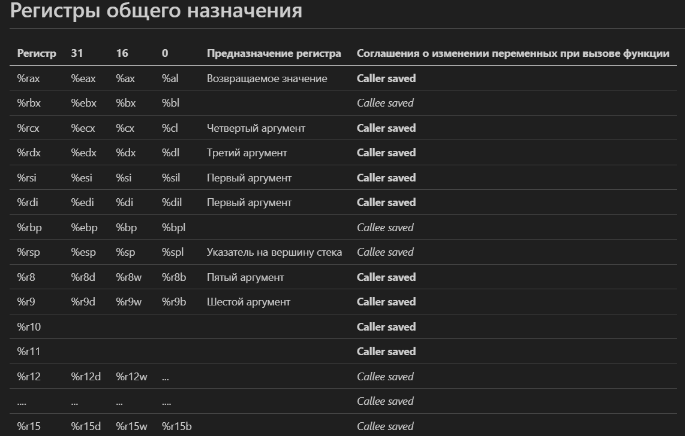
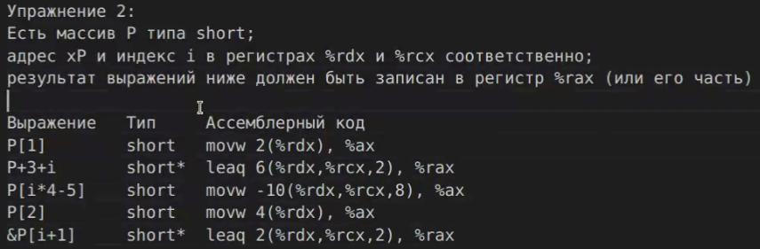
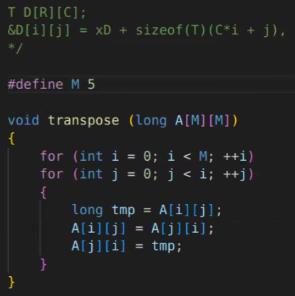
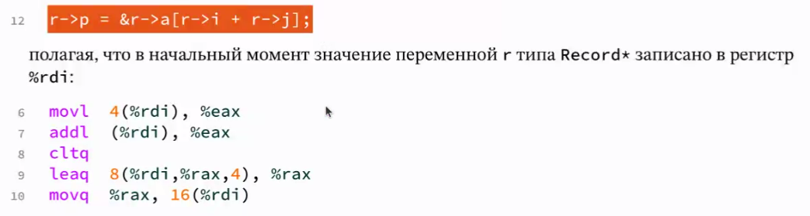
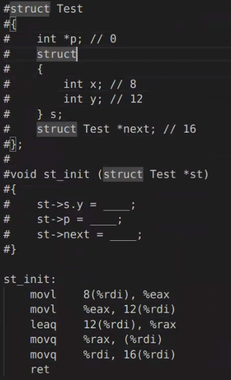
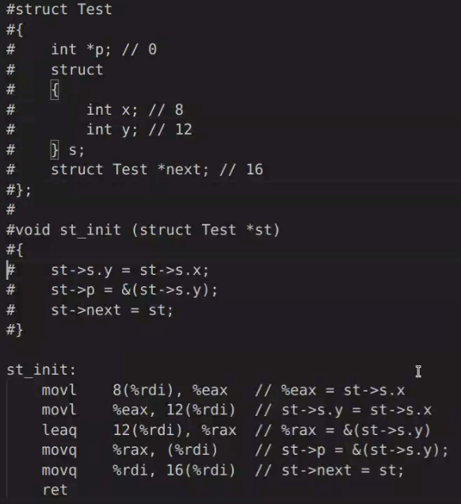

## Семинар 13

любой указатель занимает 8 байт. Ключевая особенность массива - последовательно хранится в памяти, выделяем память учитывая тип данных

Элементарное упражнение 1

перед упражнением 2 обратимся к великой табличке которую мне нужно выучить

теперь сложны пример прям от Бурмистрова 

 

основное тело цикла (еще там есть большие доп условия с прыжками i j и тд)

теперь меняем флаг оптимизации на более агрессивную
получилось достаточно сложно потому что мы там очень пошамански работам с элементами, 40 прибавляем на новую строку, 8 добавляем на новый элемент

### Структуры 

cltq - convert l to q - расширяем - эквивалент movslq 

 - по сути никаких структур нет, мы манипулируем с памятью и данным, лежащими по определенным адресам. Компилятор понимает смещения и прям "вшивает". От структур переходим к операциям с обращением памяти

упражнение: 

### Выравнивание
Проблема выравнивания возникает когда в структуре данные разных типов

Существует некоторое правило (не является к нарушению работы кода, отчасти исторически взялось )