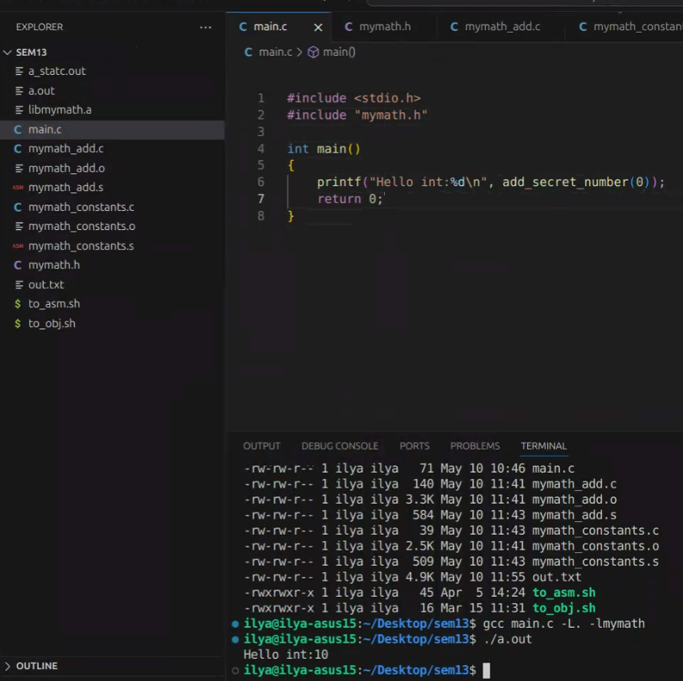

## Семинар 13

```c
#include <stdio.h>
{
    printf("Hello, world!");
    return 0;
}
```

```shell
gcc main.c
```
Компиляция состоит из препроцессинга, компилции, ассемблирование, линковка 

Компилятор генерит ассемблитрованный код, само создание объектных файлов - этап ассемблирования - flag -s

```shell
gcc main.c -v //verbl
```
перенаправялем стрелочками
```shell
gcc main.c -v 2> out.txt
```
gcc - набор компиляторов, делает много больше работы. Gcc - драйвер компиляции, обращаясь к gcc просим запустить весь этап компиляции

сollect2 - настоящее название линкера

.i - выход из препроцессора

-E -o - вывод результата препроцессинга

Пусть нам хотелось бы разработать свою библиотеку о как

мы на физтехе учимся, пустьбиблиотека будет с мат функциями

mymath_add.c
```c
extern const int g_secret_number;

int add(int a, int b) {
    return a + b;
}

int add_secret_number(int a, int b) {
    return a + g_secret_number;
}
```

mymath_constants.c
```c
const int g_secret_number = 10;
```

```shell
./to_obj.sh mymath_add.c mymath_constants.c
ar rcs libmymath.a //статическая библиотека// mymath_add.o mymath_constants.o
```
получили статическую библиотеку - некоторый архивчик в котором есть объектники

```shell
nm //исследуем объектный файл// libmymath.a
```
что-то получили, что она состоит из 2 объектных файлов

T - потому что текст - функции лежат в секции .text 

secret number - как сущность U - undefined - внешний объект которого нет в файле, но он должен быть где-то расопложен

R - redonly data - переменная - потому что константная

Если снимем константность - просто .data D

```shell
./to_asm.sh mymath_add.c mymath_constantc.c 
```
Смотрим на наш ассемблерный код

.text - код

.data - глобальный перем

.rodata - константы

.bss - better save space

основные 4 секции, но могут быть и другие

также есть секция .comm но это типо тоже глобальные неинициализированные переменные и тд

насчет последнего - почему так?) Создадим переменную и инициализируем ее нулем

mymath_constants.c
```c
const int g_secret_number = 10;
const int g_i2 = 0;
```
g_i2 - окажется в .bss - неинициализированные переменные (глоб.) либо переменная, инициализировання нулем

если не инициализировали явно - то там мусор; в отношении глобальных - они инициализируются нулем. 
перед просмотром там есть 
```shell
nm a.out
```



### Теперь про динамическую
```shell
gcc -fPIC //позиционно независимый код// -c mymath_add.c mymath_constants.c
```

```shell
gcc -shared mymath_add.o mymath_constants.o -o libmymath_s.so //shared object//
```
